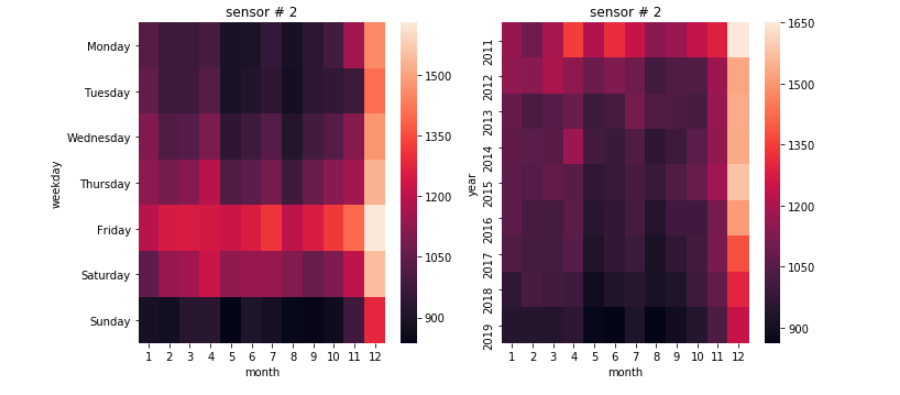
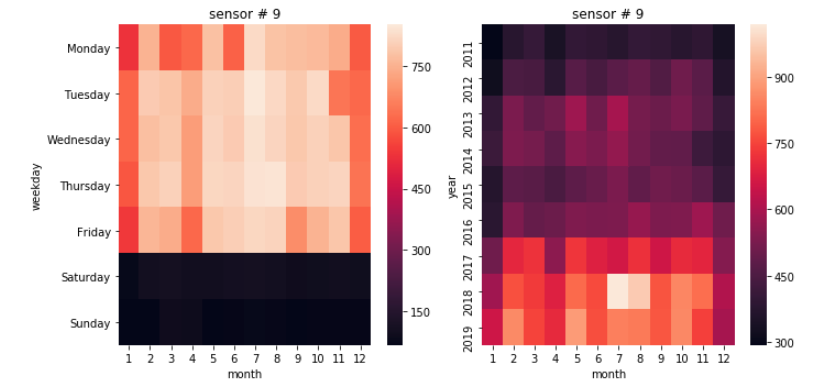

# Predicting Pedestrian Footfall:   Location Data Analysis of Melbourne, Australia

Utilizing datasets provided by the city of Melbourne, I analyzed sidewalk sensor count data in relation to location features of the city. 

## Table of Contents
* [Project Goals](#project-goals)
* [Data Sources](#data-sources)
* [Time Series Analysis](#time-series-analysis)
* [Mapping Location Features](#mapping-location-features)
* [Regression to Predict Daily Footfall Based on Location Features](#regression-to-predict-daily-footfall-based-on-location-features)
* [Forecasting Future Footfall](#forecasting-future-footfall)
* [Future Ideas](#future-ideas)

## Project Goals
After studying city planning and design in university, I have been very interested in how people move around a city and the trends that develop in pedestrian traffic. To explore this interest from a data perspective, I chose to analyze a dataset from Melbourne, Australia that has hourly counts from sidewalk sensors around the city. In order to better understand the flow of people through the city, I also integrated several other datasets with features of the city such as landmarks and bike share docks. By combining the pedestrian sensor data with nearby features of the city, I hoped to gain a stronger understanding of the location features that influence when and where people walk in various areas of the city. The findings of this project would be influential to prospective business owners who are deciding where to open a physical store so that they know which areas are the busiest at certain times. City planners could also find this analysis useful for predicting how much a new development or city feature would impact the nearby pedestrian footfall.

**Prediction:** Nearby buildings and city infrastructure impact the amount of footfall an area receives.  
**Goals:** Discover which features have the greatest impact on footfall, and make prediction about future trends.  

## Data Sources
* [Hourly Sidewalk Sensor Counts](#hourly-sidewalk-sensor-counts-) 
* [Hourly Weather](#hourly-weather-) 
* [Yearly Building Data](#yearly-building-data-) 
* [Bike Dock Locations & Capacities](#bike-dock-locations-&-capacities-)
* [Landmarks and Points of Interest](#landmarks-and-points-of-interest-)
* [Street Lighting](#street-lighting-) 

#### Hourly Sidewalk Sensor Counts  
This dataset had location coordinates for each sensor, a sensor ID number, datetime of hourly records, and hourly count values. Data is given from 2009-present and is updated monthly. When the data collection began in 2009 there was only 18 sensors, and now there is 65, so many sensors have been added over the past ten years. During data cleaning, I found that many sensors had faulty records, and the counts would suddenly drop out for weeks or months at a time. New sensors would also be added halfway through the year. For consistancy, I created a function to produce a yearly list of sensors that had full records for at least 12 months at a time. Since the records were not very stable for the first two years and the records for 2020 are not yet a full 12 months, the scope of the sensors was altered to be 2011 - 2019. Below is a Tableau map visualisation of all the sensor's locations across the city. 

---

#### Hourly Weather  
Using Selenium, I scraped hourly weather data for Melbourne from 2011 - 2019. This was included as an exogenous variable in the Time Series Analysis of the Sensor Count data.  

---

#### Yearly Building Data  
This dataset had yearly census information on building uses, number of floors, accessibility, and location coordinates. Below is a visualisation of the building data from 2018, with the colors representing different building uses.  

---

#### Bike Dock Locations & Capacities  
Until the end of 2019 Melbourne had a bike share system in the city, and this data set includes bike dock locations and capacities.  

---

#### Landmarks and Points of Interest  
This dataset provides the locations of various landmarks and points of interest in the city. The map below shows the various types of locations included, such as community use, place of worship, and many others.  

---

#### Street lighting  
Includes all city owned lighting with the wattage, light type, and location.  

---

## Time Series Analysis

To fully analyze the Footfall Sensor dataset, the first step was to perform a time series analysis for each sensor. This allowed me to better understand trends in each sensor and see how accurately I could forecast future footfall based on past counts and trends. 

Here is two sensors that had valid records for the entire period 2011-2019:  

### Trends
To begin understanding the trends and patterns for an individual sensor, I created heatmaps for each sensor.  

From these two different sensors we can already notice that there are dramatically different trends. Sensor 9 appears to be in a business district since it is almost exclusively busy on Monday-Friday, while sensor 2 is busiest on Fridays and in December. 

---

**Forecasting with SARIMAX Model**
For the time series modelling, I resampled the hourly data to be daily, which generalized the data slightly but gave smoother data. Since there were many hours in the middle of the night when no one would pass over the sensors, there were many hours when the records would be zero.  
When I first put the sensor data into the time series forecasting the scores were not very accurate, and the future predictions soon became a flat line that did not take trends into account. To add more information, I scraped hourly weather using Selenium and added this as an exogenous variable in the SARIMAX model. However, this did not dramatically improve scores. Depending on the sensor, adding weather data either slightly improved or diminished the root MSE and R2 scores. While this was a disappointing discovery, it was interesting that some sensors were more influenced by the weather than others.  
Below are the time series forecasts for the sensors from above, sensor 2 & 9. The different trends can be observed, yet both of the deep red forecast lines are not very accurate. 

* Sensor 2 Scores  
  -Root MSE: 203.21  
  -R2 Score: .306  

  
* Sensor 9 Scores  
  -Root MSE: 284.16  
  -R2 Score: .319  
 

Since I predicted that location features would impact footfall, I took these scores as a relative baseline to compare my future location based predictions against. This time series was not neccessarily very accurate, and since it has to be done for one sensor at a time it is not very time efficient or applicable to sensors that don't have years of past data. 

## Mapping Location Features

In order to begin adding location as a feature for predicting footfall at different sensors, I had to find a way to combine all of the location based datasets. I wanted to only include features that were within a very small distance from the sensors because I thought this would give a better idea of the features that impact footfall the most. To do this, I utilized the GeoPandas python library to create a polygon around each sensor with a 100 meter radius. Below is the map I created in folium that has the sensors plotted, and each of their surrounding radii.  

---

### Mapping Nearby Features 
Then, using GeoPandas again, I developed a function to check each item in each of the location datasets and see if the coordinate was inside each sensor's radius. If the point was inside, it was added to a list of coordinate points along with what type of feature it was. Then I created a function to plot all the features inside each sensor's radius. Below is the maps for sensor 2 and 9 with all of the features inside their radius. With this visual, we can see all of the features within a 100 meter radius from the sensor. Street lighting is coral, landmarks are purple, buildings are light blue, and street infrastructure is gray. The sensor can be seen in the center of the circle in dark blue.  

**Sensor 2**   
   

**Sensor 9**   

## Regression to Predict Daily Footfall Based on Location Features
Now that we could see which features are within 100 meters from each sensor, modelling could begin. For the first stage of modelling, I wanted to do a relatively simple Linear Regression to see it was possible to predict daily footfall for each sensor based only on the location features nearby. The features for the model were the number of each type of feature within the radius and the sensor ID, and was predicting daily average footfall. Below is a snippet of what the dataframe looked like. In total there was over 60 columns detailing the number of each nearby feature.  

Since the number of location features did not vary within the year did not change, I did not expect the model to be accurate in predicting the daily variation and trends. However, I thought it would be interesting to see which features most impacted footfall, and see how the scores compared to the time series model above. The training and test data was taken as a random 80/20 split, with all years mixed into each group.

### Model Results
* Linear Regression  
  -Training Score: 0.7751  
  -Test Score: 0.7749  
  -CV Score: 0.7747  
  -Root MSE: 224.592  
The test score was much higher compared to the r2 score of the time series model, and the model seems to be performing relatively well already without much tuning. The root MSE is quite similar to the time series models above, yet this score is accounting for all sensors at the same time rather than being specific to one at a time. This model is performing better than the time series so far, and is much more generalizable. 

---

### Feature Importance

**Features that decrease footfall:**  
  
Rather surprisingly, a greater number of retail locations in a sensor's radius actually negatively impacted footfall. Other interesting features that decreased footfall where a greater number of average building floors and parking locations.

**Features that increase footfall:**  
  
A greater number of seats and hospitals had a positive impact on the amount of footfall a sensor recieved, as well as several pieces of city infrastructure such as floral boxes and tree guards. These were perhaps most surprising since these are the features that we would not neccessarily pay specific attention to when we walk around the city.

---

#### Actual Vs. Predicted

This graph shows the difference between what the Linear Regression model predicted and the actual daily footfall. From this, we can observe the main drawback of this model - it predicts the same value everyday for each sensor. Since the features don't change within the year, the model has no way of taking daily trends into account. This also prevents the model from performing well when forecasting future footfall.  
Even after tuning this model while using the same features, the CV score would improve to .828 by using a Decision Tree Regressor with GridSearchCV, yet the same problem with the Actual Vs. Predicted graph remains. This model using only location features can only become so accurate since it does not account for daily variation, and is unable to forecast future footfall.

## Forecasting Future Footfall

In order to develop a model that could predict future footfall, I combined the location features used in the previous regression model with more date based information. Along with the number of different location features in the radius, information on the month, day, year, and day of week were included as features. Additionally, I included the number of counts from that day one year prior, or two years prior if there was not valid data from the previous year. With these features, the train and test data was split based on year, so the model was trained on data from 2011 - 2017 and the test data was all data from 2018.  
After tuning the parameters and testing several different model types, this model produced the highest scores so far, and was able to predict 2018 daily footfall for each sensor with 90% accuracy.  

### Model Results
* Ada Boost Regressor  
  -Training Score: 0.9994  
  -Test Score: 0.9032  
  -CV Score: 0.8744  
  -Root MSE: 158.7632  
Each of these scores are better than the previous regression models and the time series models. This model is able to predict daily footfall for 2018 with about 90% accuracy, and the root MSE is much lower than each of the previous models. 

---

### Feature Importance

**Features that Most Influence Predictions:**  
  
The features that were most influential for this model's predictions were all of the date based information. The counts from the previous year were the most important, but other information on the date was also important. This shows that there is a yearly trend in each sensor that is useful for forecasting. There were also several location based factors that were relatively important for predicting, such as the number of basketball hoops, bollards, average number of floors, and number of bicycle rails. 

---

#### Actual Vs. Predicted
  
With this graph we can see that the model is able to predict different daily counts for each sensor, unlike the previous model that predicted the same number of counts for each day. This model is therefore much more accurate, and there is a linear trend between predicted and actual. There are a couple of strong outliers where the model predicted much higher or lower than the actual, and these points could be investigated futher to better understand what influenced these variations. 

## Future Ideas
This project was a great learning experience, and allowed me to better understand geospatial data science. Overall I am very happy with the results that I found, and am eager to continue working on this project in the future. As I develop this project further, I think it would have important applications for business owners and city planners in Melbourne to better understand pedestrian trends.  
Some ideas I want to explore further to improve my model are:
* return to analyzing hourly data rather than daily to get more precise trends
* include more location features of the city 
* include seasonal information such as city events, public holidays, sporting events, etc.
* cluster sensors based on location features so it is possible to predict footfall for new sensors that don't have previous year data 

