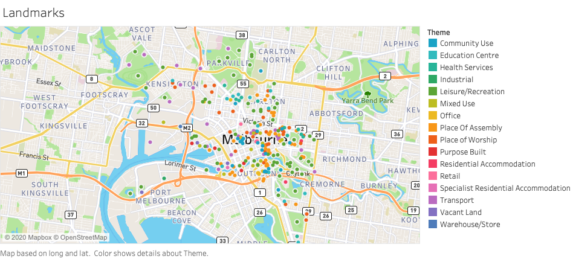

# Predicting Pedestrian Footfall:   Location Data Analysis of Melbourne, Australia

Utilizing datasets provided by the city of Melbourne, I analyzed sidewalk sensor count data in relation to location features of the city. 

## Table of Contents
* [Project Goals](#project-goals)
* [Data Sources](#data-sources)
* [Time Series Analysis](#time-series-analysis)
* [Mapping Location Features](#mapping-location-features)
* [Regression to Predict Daily Footfall Based on Location Features](#regression-to-predict-daily-footfall-based-on-location-features)
* [Forecasting Future Footfall](#forecasting-future-footfall)
* [Future Ideas](#future-ideas)

## Project Goals
After studying city planning and design in university, I have been very interested in how people move around a city and the trends that develop in pedestrian traffic. To explore this interest from a data perspective, I chose to analyze a dataset from Melbourne, Australia that has hourly counts from sidewalk sensors around the city. In order to better understand the flow of people through the city, I also integrated several other datasets with features of the city such as landmarks and bike share docks. By combining the pedestrian sensor data with nearby features of the city, I hoped to gain a stronger understanding of the location features that influence when and where people walk in various areas of the city. The findings of this project would be influential to prospective business owners who are deciding where to open a physical store so that they know which areas are the busiest at certain times. City planners could also find this analysis useful for predicting how much a new development or city feature would impact the nearby pedestrian footfall.

**Prediction:** Nearby buildings and city infrastructure impact the amount of footfall an area receives.  
**Goals:** Discover which features have the greatest impact on footfall, and make prediction about future trends.  

## Data Sources
* [Hourly Sidewalk Sensor Counts](https://github.com/jewelbritton/Capstone/blob/master/README.md#hourly-sidewalk-sensor-counts-) 
* Hourly Weather 
* Yearly Building Data 
* Bike Dock Locations & Capacities
* Landmarks and Points of Interest
* Street Lighting 

#### Hourly Sidewalk Sensor Counts  
This dataset had location coordinates for each sensor, a sensor ID number, datetime of hourly records, and hourly count values. Data is given from 2009-present and is updated monthly. When the data collection began in 2009 there was only 18 sensors, and now there is 65, so many sensors have been added over the past ten years. During data cleaning, I found that many sensors had faulty records, and the counts would suddenly drop out for weeks or months at a time. New sensors would also be added halfway through the year. For consistancy, I created a function to produce a yearly list of sensors that had full records for at least 12 months at a time. Since the records were not very stable for the first two years and the records for 2020 are not yet a full 12 months, the scope of the sensors was altered to be 2011 - 2019. Below is a Tableau map visualisation of all the sensor's locations across the city. 

#### Hourly Weather  
Using Selenium, I scraped hourly weather data for Melbourne from 2011 - 2019. This was included as an exogenous variable in the Time Series Analysis of the Sensor Count data.  

#### Yearly Building Data  
This dataset had yearly census information on building uses, number of floors, accessibility, and location coordinates. Below is a visualisation of the building data from 2018, with the colors representing different building uses. 

#### Bike Dock Locations & Capacities  
Until the end of 2019 Melbourne had a bike share system in the city, and this data set includes bike dock locations and capacities. 

#### Landmarks and Points of Interest  
This dataset provides the locations of various landmarks and points of interest in the city. The map below shows the various types of locations included, such as community use, place of worship, and many others.

#### Street lighting  
Includes all city owned lighting with the wattage, light type, and location. 

## Time Series Analysis

My first step was to perform a time series analysis for each sensor, and see how accurately I could forecast future footfall based on past counts and trends. 

Here is two sensors that had valid records for the entire period 2011-2019:
*map*

To begin understanding the trends and patterns for an individual sensor, I created heatmaps for each sensor. 
*heatmap*
From these two different sensors we can already notice that there are dramatically different trends. Sensor 9 appears to be in a business district since it is almost exclusively busy on Monday-Friday, while sensor 2 is busiest on Fridays and in December. 

## Mapping Location Features

## Regression to Predict Daily Footfall Based on Location Features

## Forecasting Future Footfall

## Future Ideas
